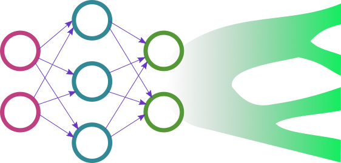

<p align="center">
  
</p>

# Phyloformer (RoPE Modified)

A modified version of Phyloformer for phylogenetic distance estimation, retrofitted with:

- **Rotary Position Embeddings (RoPE)**
- **Input projection layer before transformer blocks**

This version aims to improve inductive bias handling in transformer layers for sequence modeling in phylogenetics.

#### Original here:
https://github.com/lucanest/Phyloformer

---

## Setup

```bash
git clone https://github.com/lucanest/Phyloformer.git
cd Phyloformer
conda create -n phylo python=3.9 && conda activate phylo
pip install -r requirements.txt
